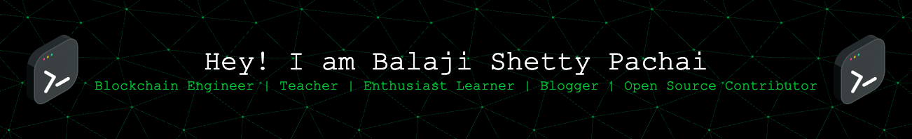

<h3 align="center">

</h3>
<h3 align="center">
“I'm the type of person that if you ask me a question and I don't know the answer,
I'm going to tell you that I don't know.

But I bet you what, I know how to find the answer and I will find the answer.”

 The Pursuit of Happyness 😄</h3>

  

  

  

- 🔭 I’m currently working on [Curiosity - Continuous Learning](https://github.com/balajipachai/curiosity)

- 🌱 I’m currently learning **C++ STL, DSA, Flutter**

- 👯 I’m looking to collaborate on **Backend Development, Blockchain Project, Smart Contract Development**

- 📝 I regularly write articles on [Blockchain Development, Solidity, My New Learnings](Blockchain Development, Solidity, My New Learnings)

- 💬 Ask me about **Blockchain Development, Consulting, Training & Teaching.**

- 📫 How to reach me **iamthebatman.superjet886@passfwd.com**

- 📄 Know about my experiences [https://www.linkedin.com/in/balaji-shetty-pachai/](https://www.linkedin.com/in/balaji-shetty-pachai/)

- ⚡ Fun fact **All of ERC20's & ERC721's trivial learning is around the functions transfer & transferFrom.**

---
### Smart Contract Development Portfolio:
---

**Successfully engaged in blockchain development, showcasing a comprehensive portfolio of impactful smart contract creations. Meticulously designed and implemented various contracts, demonstrating proficiency in the realm of decentralized applications. Check out my notable contributions below:**

1. **Treasury Smart Contract:**
   - Developed a robust treasury smart contract, ensuring efficient fund management and financial transparency.
   - Implemented rigorous testing procedures to validate the functionality and security of the contract.
    - [Contract on Mainnet - Treasury Public Sale: 0x9741FCB37249584F52c7DC613e5f2bc6280D463e](https://etherscan.io/address/0x9741fcb37249584f52c7dc613e5f2bc6280d463e)
    - [GitHub Repository](https://github.com/b-cube-ai/b-cube-ico/tree/feat/new-sale-contracts)

2. **Solhub Token Ecosystem:**
   - Spearheaded the design and implementation of the SolhubToken contract, incorporating industry-standard security measures.
   - Extended the ecosystem with the SolhubTokenSale contract, facilitating a secure and seamless token sale experience.
   - Independently conceptualized and implemented the SOLHUB token contract, incorporating essential security measures. Designed and developed the SolhubTokenSale smart contract, ensuring a meticulous implementation. Engineered an Investor contract in compliance with solidity standards, further expanding the project's functionality. Additionally, crafted a Vesting contract to enhance the platform's features.
   
     **Investor Contract:**
   - Introduced an Investor contract, adhering to Solidity best practices and standards to ensure a secure investment environment.

        **Vesting Contract:**
   - Engineered a Vesting contract to address the complexities of token vesting, enabling controlled and scheduled token releases.

   - [GitHub Repository](https://github.com/solhub-finance/ico-contracts)

3. **FAVE ERC-20 Token:**
   - Developed the FAVECOIN ERC-20 token contract, featuring an innovative fee mechanism for specific transfers.
   - Demonstrated a commitment to financial control and flexibility within the tokenomics of FAVECOIN.
   - [Contract on Binance Mainnet](https://testnet.bscscan.com/token/0x51aC4626A5223305a22336483bFfE7862f5f0858#code)
   - [GithHub Repository](https://github.com/balajipachai/favecoin-sc)

4. **Staking Contract**
    - Gained a profound understanding of the system's (Staking) functionality, formulated a comprehensive design document, and successfully implemented the desired features within the smart contract. Rigorously tested each component to ensure seamless functionality and adherence to specifications. 
    - [Contract on Binance Mainnet - BitdiamondStaking](https://bscscan.com/address/0x34de06b7036db790e706f28a7ef9fcedb98971cc#code)
    - [GitHub Repository](https://github.com/balajipachai/bitdiamond-sc)

5. **Dividend-Paying Token for PlaytimeProfit**
    - Initiated the conception and implementation of a cutting-edge dividend-paying token for PlaytimeProfit, demonstrating proficiency in smart contract development and innovative tokenomics.
    - [GitHub Repository](https://github.com/playtimeprofit/definetics)

 **Smart Contract Refactoring and Audit Response Portfolio:**

   Embarked on a comprehensive journey of refactoring and enhancing the Garfield token contract, diligently addressing all audit recommendations. The meticulous effort involved not only refactoring the existing codebase but also fortifying it with additional tests, aiming for near 100% code coverage. Below is a detailed breakdown of the tasks accomplished:

   1. **Refactoring for Enhanced Security:**
   - Conducted a thorough analysis of the Garfield token contract, identifying areas for improvement in terms of security and code efficiency.
   - Applied industry best practices in smart contract development to refactor and optimize the existing codebase.

   2. **Audit Response Implementation:**
   - Addressed all findings and recommendations from the comprehensive audit report, ensuring that each concern was thoroughly understood and appropriately resolved.
   - Collaborated with auditors to clarify any ambiguities and implemented changes that align with industry standards and best practices.

   3. **Testing Infrastructure Overhaul:**
   - Revamped the testing infrastructure for the Garfield token contract to accommodate new features and changes introduced during the refactoring process.
   - Implemented a rigorous testing suite covering a wide range of scenarios to ensure the robustness and reliability of the contract.

   4. **Code Coverage Aimed at Perfection:**
   - Instituted a testing strategy with the goal of achieving close to 100% code coverage for the Garfield token contract.
   - Employed various testing methodologies, including unit tests, integration tests, and edge-case scenarios, leaving no stone unturned in ensuring the contract's stability.

   5. **Documentation and Transparency:**
   - Updated and expanded documentation to reflect the refactored codebase, ensuring that developers, auditors, and stakeholders have access to clear and comprehensive information.
   - Prioritized transparency by providing detailed commit messages and documentation for each change made during the refactoring process.
   - [GitHub Repository](https://github.com/AndreaGarfield/GAR-SC-EDIT-)

<u>*This portfolio showcases not only technical proficiency in smart contract development but also a commitment to security, transparency, and adherence to industry standards.It reflects a proven track record of blockchain development expertise, with each project showcasing a unique set of skills and a commitment to excellence.*</u>

---

<h3 align="left">Connect with me:</h3>

<h3 align="left">Languages and Tools:</h3>

                       

<h3 align="left">Support:</h3>

  

&nbsp;

