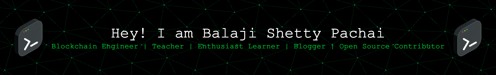

# 👋 Welcome to My Portfolio

  

## 🏠 Home

Senior Blockchain Engineer with 10+ years in software development and 7+ years specialising in EVM and multi-chain systems. I own the full Web3 lifecycle — smart contracts, deterministic indexing (Subsquid/The Graph), and high-performance backend APIs. Currently building production-grade L2 infrastructure at Shiba Inu (Shibarium), with a track record spanning 10+ blockchain projects across DeFi, NFTs, DeSci, and enterprise domains. Passionate about software development, teaching, and public speaking.

- Smart Contract Development
- Deterministic Indexing & Data Pipelines
- Backend APIs (Node.js, GraphQL, REST)
- Cross-chain Interoperability
- DeFi, NFTs & DeSci
- Blockchain Architecture

## 👨‍💻 About Me

### Professional Experience

- **Senior Smart Contract, Web3 Backend & Indexing Engineer** at Shiba Inu (Apr 2024 – Present)
  - Own end-to-end data pipelines: smart contracts → Subsquid indexers → Node.js/GraphQL APIs powering Shibarium ecosystem tools
  - Architected Subsquid indexers syncing millions of L2 blocks with deterministic event modelling, handling finality, reorgs, and RPC inconsistencies
  - Led smart contract development for ShifuAirdrop [Proxy](https://etherscan.io/address/0xd86002fa355f10ab6fada604b337160975e7bc01#code) - [Implementation](https://etherscan.io/address/0x102e37993838f539d52170ee480055cfdef3136a#code)
  - Implemented cross-chain token standards using Chainlink CCIP
  - Developed Central Authentication Service SDK [cas-sdk](https://github.com/shibaone/cas-sdk)
  - Built smart contracts for On Chain Gaming Registry [game-registry](https://github.com/shibaone/game-regsitry/tree/feat/batman/reward/smart/contracts)
  - Developed cross-chain swap contracts using CCIP and Li.Fi [crosschain-shibaswap](https://github.com/shibaone/crosschain-shibaswap)
  - Developed, implemented & deployed Shib Newsletter Cover V2 NFT contracts [Proxy](https://www.shibariumscan.io/address/0xa68e8083507688bCA90129102885F0775B5df706?tab=contract) - [Implementation](https://www.shibariumscan.io/address/0xa55D73e4Be7d4C58C13d71A1F33aa9025E97e81e?tab=contract)

- **Senior Software Engineer (Blockchain)** at V2Soft (May 2021 – Feb 2024)
  - Translated client requirements into production Solidity smart contracts; architected comprehensive blockchain solutions
  - Designed, developed, and deployed the V2Soft 25th Anniversary NFT system end-to-end — Solidity contracts, Node.js APIs, MySQL, AWS
  - Built the Vehicle NFT platform storing vehicle lifecycle data on-chain via ERC-721 with IPFS metadata
  - Ensured transaction atomicity from submission to block inclusion across all on-chain operations
  - Developed PoCs and actively contributed to the Blockchain Innovation Team; trained newcomers on Solidity and blockchain

- **Senior Blockchain & Backend Engineer** — Self Employed / Freelance (Dec 2019 – Apr 2021)
  - Designed & deployed production smart contracts for staking, rewards, vesting, ERC20/721, and full token ecosystems
  - Built the EarnTV Reward Engine — ERC-20 issuance, staking, NFTs, and Gnosis MultiSig wallet integration
  - Developed smart contracts for OpenTherapeutics (Decentralised Science) — researcher rewards, funding, and collaboration
  - Led backend & blockchain development at Humation Limited (Junior Team Lead) — cross-chain interoperability across Ethereum, TRON, Waves, and Stellar

- **Senior Software Engineer** at Harbinger Systems (Jan 2017 – Dec 2019)
  - Specialised in Solidity and Truffle Framework; created private blockchain networks with diverse consensus algorithms
  - Developed Certificate of Authenticity — ERC-721 NFT platform for artwork provenance with IPFS and React.js front-end
  - Forked ARK blockchain to create Blockpool — analysed architecture, proposed changes, and implemented the fork
  - Created Loan Lending App and Land Records DApps; achieved 100% smart contract test coverage via TDD
  - Established blockchain nodes on AWS; deployed contracts across Ganache, private networks, testnets, and mainnet

- **Associate Software Engineer** at AtoS India Pvt. Ltd (May 2014 – Jul 2015)
  - Monitored production servers, scheduled batch jobs, tested endpoints, and conducted root-cause analysis of incidents

### Skills & Expertise

  
  
  
  
  
  
  
  
  
  
  
  
  
  
  
  
  
  
  
  

## 🎓 Education

- **M.Sc. in Scientific Computing** — Savitribai Phule Pune University (CGPA: 8.6/10, Grade A+) | Jul 2015 – Apr 2017
- **B.Sc. in Computer Science** — Nowrosjee Wadia College (CGPA: 6.8/10, Grade A) | Jul 2011 – May 2014

## 📜 Certifications

- **Consensys Blockchain Developer Bootcamp** — Scholar Recipient
- **IAAA Certified Ethereum Blockchain Developer and Professional**
- **Arc Certified Remote Developer** — Arc
- **Intensive Certificate in German Language** — Savitribai Phule Pune University

## 🚀 Projects

### Enterprise Projects

#### OpenTherapeutics (DeSci)

- Decentralised science platform for researcher funding, rewards, and collaboration
- Migrated contracts from Ethereum to Polygon
- Advanced security measures with MultiSig wallet
- [View Contract](https://etherscan.io/address/0x8282c4f8debbb1d0749e870697df688f65937cbb#code)

#### EarnTV

- ERC-20 reward engine with staking, NFTs, and Gnosis MultiSig wallet integration
- NFT-based subscription system
- Secure token economics
- [View Contract](https://polygonscan.com/address/0xc77aea972f862df1f6a520be673df63a01255ff9#code)

#### Shibarium Indexing & Data Pipelines

- Subsquid indexers for staking, rewards, token transfers, validator ops, and custom Shibarium L2 logic
- Deterministic event modelling syncing millions of L2 blocks

#### V2Soft 25th Anniversary NFT

- End-to-end NFT issuance: Solidity contracts, Node.js APIs, MySQL, AWS

#### Vehicle NFT

- On-chain vehicle lifecycle tracking via ERC-721 with IPFS metadata storage

### Personal Projects

- **Treasury Smart Contract**: [View Code](https://github.com/b-cube-ai/b-cube-ico/tree/feat/new-sale-contracts)
- **Solhub Token Ecosystem**: [View Code](https://github.com/solhub-finance/ico-contracts)
- **FAVE ERC-20 Token**: [View Code](https://github.com/balajipachai/favecoin-sc)
- **Staking Contract**: [View Code](https://github.com/balajipachai/bitdiamond-sc)

## 📝 Blog

### Latest Articles

#### Medium

- [How to estimate gas for a blockchain transaction?](https://medium.com/@balajishettypachai)
- [Understanding Cross-chain Interoperability](https://medium.com/@balajishettypachai)
- [Smart Contract Security Best Practices](https://medium.com/@balajishettypachai)

#### LinkedIn

- [How OpensSea works with any ERC721 contract?](https://www.linkedin.com/pulse/how-openssea-works-any-erc721-contract-balaji-shetty-pachai)
- [Get All ERC721 Tokens Owned By An Account](https://www.linkedin.com/pulse/get-all-erc721-tokens-owned-account-balaji-shetty-pachai)
- [Scaffold-ETH: Debug Contracts Tab](https://www.linkedin.com/pulse/scaffold-eth-debug-contracts-tab-balaji-shetty-pachai)

## 📫 Contact

  
  
  

## 📊 GitHub Stats

  
  

---

  Built with ❤️ by Balaji Pachai

